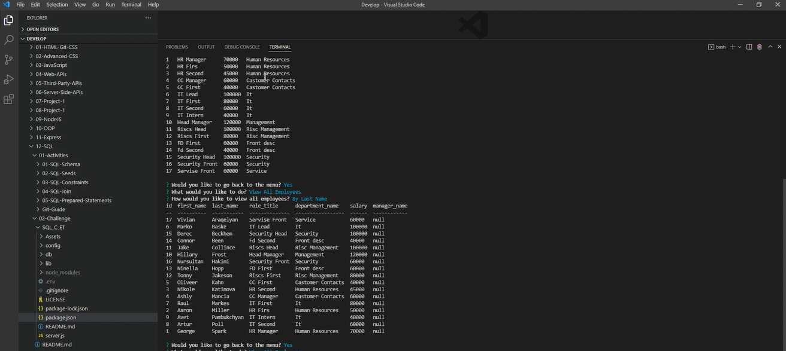

# Employee Tracker

This application is comand line aplication with interactive functionality. By running this application we can acces database based data and manage it.

## Video

[](https://drive.google.com/file/d/1HNT_YkAEMG9C6MCqczNAFqgo9o3pJ24c/view)

Video: [Download Local File](https://github.com/AM0726Github/SQL_C_ET/Assets/videos/Untitled.webm) | [Google Drive](https://drive.google.com/file/d/1HNT_YkAEMG9C6MCqczNAFqgo9o3pJ24c/view)

## Installation
To install this project, please follow these steps: 
1. Make sure you have [Node.js](https://nodejs.org) and [MySQL](https://dev.mysql.com/downloads/) installed.
2. Through the command line, go to the folder you wish this application's folder to be in.
3. Do `git clone` of the repository to get the application's files.
4. Enter `mysql -u root -p` to open MySQL.
5. Run `source db/db.sql` to get the database, then run `source db/schema.sql` to get the tables, then run `source db/seeds.sql` to get the seeds

In order to install all of them, enter the following into the command line:
```
npm install
```

## Usage
To run this project, enter the following into the command line:
```
npm start
```
